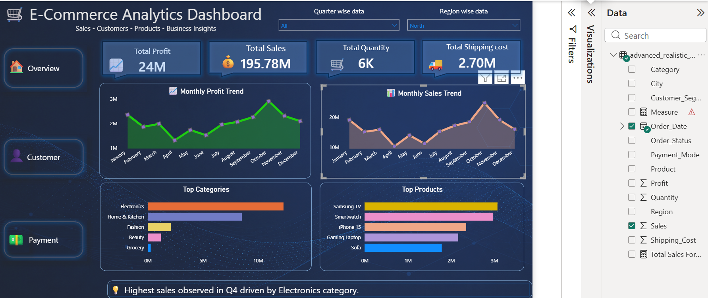
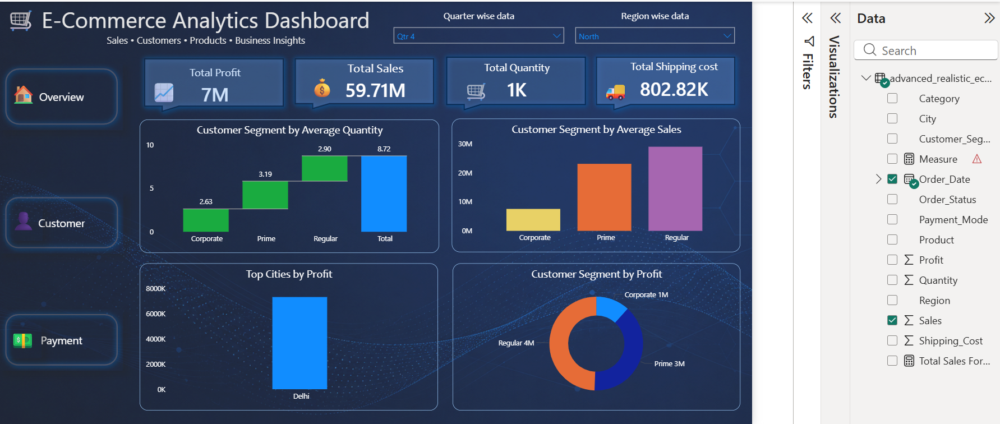
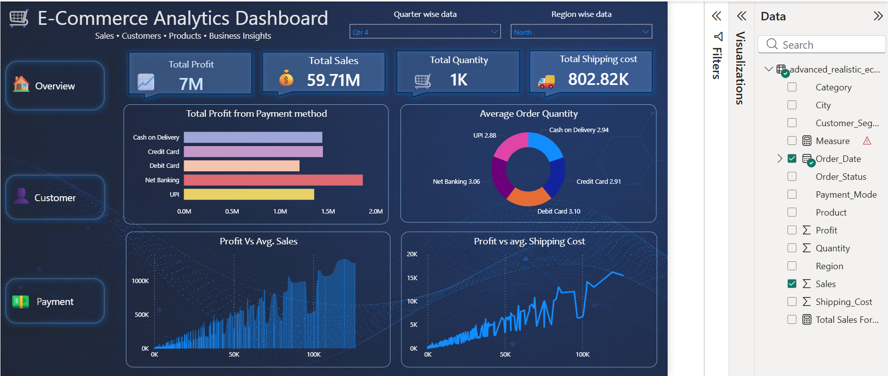

# E-Commerce Analytics Dashboard | Power BI

## Project Overview
This project is an interactive E-Commerce Analytics Dashboard created using Power BI. The dashboard provides insights into sales performance, customer behavior, product trends, and payment analysis.

## Features
- Interactive KPI Cards
- Monthly Sales & Profit Trends
- Customer Segmentation Analysis
- Payment Method Analysis
- Region-wise & Quarter-wise Filtering
- Top Products & Categories Insights

## Tools Used
- Power BI
- Power Query
- DAX
- Data Visualization

## Dashboard Screenshots

## Key Insights
- Electronics category generated the highest sales.
- Q4 recorded peak business performance.
- Regular customers contributed the highest profit share.
- Net Banking and UPI showed strong payment performance.

## Author
Akki
